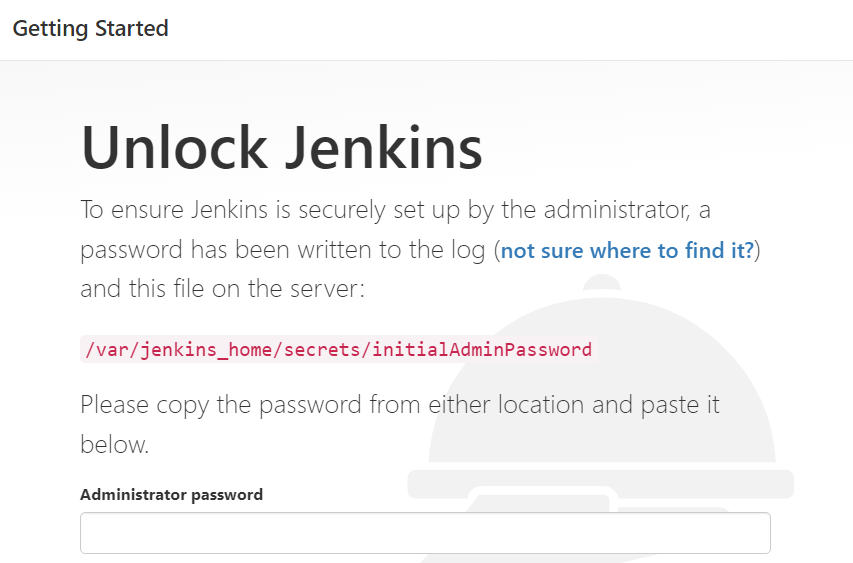

# Jenkins를 활용한 CI/CD

## Github 세팅

### 계정 연결

1. Github 접속!!
2. Settings > Developer settings > Personal access tokens
3. Generate new token 클릭
4. repo, repo_hook 체크 후 토큰 생성
5. **생성된 토큰 저장!**
    - Jenkins 설정 시 필요하다

## Jenkins Server 구축

- AWS EC2 Free tier로 Jenkins Server를 구축하는 방법
- **Docker Hub로 설치하면 자바 설치 안해도 된다!!!**
    - Docker Hub에서 Jenkins 이미지 받으면 그 안에 java 설치되어 있다
- AWS EC2 Linux 에 Jenkins 서버 구축

### Java 설치

- Java 설치
    
    ```bash
    $ sudo yum list | grep jdk //설치가능한 자바 버전 확인
    $ sudo yum install {packageName} // 자바 설치
    $ java -version // java 설치되었는지 확인
    
    $ sudo yum install java-1.8.0-openjdk-devel.x86_64 // javac 설치
    $ javac -version // javac 설치되었는지 확인
    ```
    
- 환경변수 추가
    
    ```bash
    $ which java // 자바 경로 확인
    /usr/bin/java
    $ readlink -f /usr/bin/java // 절대 경로 확인
    /usr/lib/jvm/java-1.8.0-openjdk-1.8.0.302.b08-0.amzn2.0.1.x86_64/jre/bin/java
    $ vi /etc/profile // vi 편집기 들어가서 아래 3줄 추가
    
    export JAVA_HOME=/usr/lib/jvm/usr/lib/jvm/java-1.8.0-openjdk-1.8.0.302.b08-0.amzn2.0.1.x86_64/jre/bin/java
    export PATH=$PATH:$JAVA_HOME/bin
    export CLASSPATH=$JAVA_HOME/jre/lib:$JAVA_HOME/lib/tools.jar
    
    $ source /etc/profile // 환경변수 설정 적용
    $ echo $JAVA_HOME // JAVA_HOME 확인
    $ echo $PATH  // PATH  확인
    $ echo $CLASSPATH // CLASSPATH 확인
    ```
    

### Docker + Jenkins 설치

- Docker 설치 명령어
    
    ```bash
    $ sudo yum update -y // 설치한 패키지 및 패키지 캐시를 업데이트
    $ sudo amazon-linux-extras install docker // 최신 Docker Engine 패키지를 설치
    $ sudo service docker start // Docker 서비스를 시작
    $ sudo usermod -a -G docker ec2-user // sudo를 사용하지 않고도 Docker 명령을 실행
    // 로그아웃 후 재로그인
    $ docker info // sudo 없이도 ec2-user가 Docker 명령을 실행할 수 있는지 확인
    ```
    
- [AWS Docker 설치 가이드](https://docs.aws.amazon.com/ko_kr/AmazonECS/latest/developerguide/docker-basics.html)
- Jenkins 설치 명령어
    1. Jenkins 이미지 내려 받기
        
        ```bash
        $ docker pull jenkins/jenkins:lts // Docker Hub에서 이미지 다운
        ```
        
    2. Jenkins 이미지를 컨테이너로 실행
        
        ```bash
        $ docker run -d -p 8181:8080 -v /jenkins:/var/jenkins_home --name jenkins_test -u root jenkins/jenkins:lts
        $ docker ps // 컨테이너가 올라왔는지 확인
        $ docker exec jenkins_test cat /var/jenkins_home/secrets/initialAdminPassword // Jenkins Administrator password 확인
        ```
        
    3. 브라우저를 통해 해당 포트 접속
        - 위 명령어를 통해 얻은 Administrator password 입력 후 설치
        
        
        
    4. 플러그인 설치 후 초기 계정 생성
        
        

## Jenkins 세팅

### 시스템 설정

1. GitHub 설정
    - API URL은 깃헙 api url 입력해야함
    
    
    
    - Credentials 추가
        - Credentials > Add > Kind > Secret text > Secret 에 **Github token** 넣기
            
            
            
        - Github token
            - Settings > Developer settings > Personal access tokens > Generate new token 클릭
                - repo, admin:org, admin:repo_hook 체크 후 Generate token 클릭
                - 생성 시 나타나는 token 입력!!
        - Test conection 으로 접속 되는지 확인
            
            
            
2. SSH remote hosts 설정
    - Hostname: aws ip주소
    - Port: ssh port number
    - Credentials 설정
        - Kind: SSH Username with private key 로 설정
        - Username: aws user id (ec2-user)
        - Private Key: ec2 pem key 추가
    - Test conection 으로 접속 되는지 확인
3. Publish overSSH 설정
    - Key 에 aws pem 키값 입력
    - SSH Servers
        - Name: 사용할 server name 입력
        - Hostname: aws ip 입력
        - Username: ec2 user id 입력
        - Remote Directory: remote 시 처음으로 접근할 directory 입력

### Global Tool Configuration

1. JDK 설정
    
    
    
    - 도커 이미지 내의 Java Path 확인
        
        ```bash
        $ docker exec -it jenkins_test /bin/sh
        # which java
        ```
        
2. Git 설정
    
    
    
    - 도커 이미지 내의 Git Path 확인
        
        ```bash
        $ docker exec -it jenkins_test /bin/sh
        # which git
        ```
        
3. Maven 설정
    
    
    
    - Install automatically  클릭하여 자동 maven 설치

### 플러그인 관리

- 사용할 플러그인을 설치
    - Git parameter 설치
        - git branch를 변수로 사용할 수 있음
    - Config File Provider Plugin
    - SSH
        - 빌드 환경 > Execute shell script on remote host using ssh 사용
    - Publish Over SSH
        - 빌드 후 조치 > Send build artifaces over SSH 사용

## Jenkins Item 세팅

### Item 생성

- item name 입력, Freestyle project 클릭


### General 설정

1. GitHub project 클릭
    - Project url 에 github project url 입력
2. Git Parameter 설정
    
    
    
    - git branch를 매개변수로 사용할 수 있다.
    
    
    

### 소스 코드 관리

- Git repository 세팅


### 빌드 유발

- GitHub hook trigger for GITScm polling 체크
    
    <aside>
    💡 github 에서 변경사항이 일어나면 webhook으로 Jenkins Server에 알리는데 이 기능이 체크되어 있으면 변경 시 빌드 작업 실행
    
    </aside>
    
    - Github > 생성한 Github Project Setting
        - Webhooks > Add webhook
            - Payload URL: http://{jenkins ip:port}/github-webhook
        - 잘 연결 되었는지 확인하는 방법
            - 추가한 webhook 클릭 후  Recent Deliveries 에서 확인

### 빌드 환경

1. Execute shell script on remote host using ssh 체크
    
    <aside>
    💡 SSH로 서버에 접근하여 여기서 설정한 스크립트를 실행
    
    </aside>
    
    - SSH site: 위에서 설정한 ssh site로 세팅
    - Pre build script: 빌드 전 실행할 스크립트
        - 백업 파일 생성
        
        ```bash
        cd /app/jenkins_test
        sudo cp ./jenkins_test-1.0.0.jar ./backup/jenkins_test-1.0.0.jar_`date "+%Y%m%d%H%M"`
        ```
        
    - Post build script: 빌드 후 실행할 스크립트
2. Add build step > Execute shell 클릭
    - Command: 빌드 시 실행할 명령어
        - maven clean & install
        
        ```bash
        mvn clean install
        ```
        
    
    ### Build
    
    - Add build step > Invoke top-level Maven targets
        
        <aside>
        💡 automatically maven install 시 이 설정 사용
        
        </aside>
        
        - Global Tool Configuration에서 maven을 설정해줘야 maven 설치가 된다.
        - Goals에 clean install
            - -DskipTests=true → mvn install 시 테스트 생략
            
            
            
        - 만약 자동 mvn 설치 사용 시 git project 루트 경로 이외에 프로젝트가 위치해 있으면 빌드 안됨 (ex: jenkins_test/jenkins 내부가 프로젝트면 빌드 X)

### 빌드 후 조치

1. Send Build artifacts over SSH
    
    <aside>
    💡 SSH로 접속 후 전송할 파일 설정
    
    </aside>
    
    - Name: Publish overSSH 설정한 name 사용
    - Transfers
        - Source file: 파일이 있는 경로
        - Remove prefix: 제거할 prefix (Source file 경로에서 하위 경로 입력)
        - Exec command: 마지막으로 실행할 명령어
        
        
        

## 이슈

### **AWS EC2 프리티어 사용 시 주의**

- Spring Boot 실행 시 EC2 정지 이슈
    - 메모리 부족으로 인한 중지
    - Swap 메모리 할당으로 해결
        - Swap Memory
            - 메모리 사용량이 늘어남에 따라서 디스크의 일부를 마치 확장된 RAM 처럼 사용할 수 있게 해주는 기술
            - Swap 메모리를 통해 커널에서 실제 메모리에 올라와 있는 메모리 블록들 중에서 당장 쓰이지 않는 것을 디스크에 저장하여, 사용 가능한 메모리 영역을 늘릴 수 있다.
            - 어플리케이션의 RAM 용량이 차면, swap 메모리가 자동으로 늘어나는데 이 때, 하드디스크의 디스크 공간을 swap 메모리로 사용하기 때문에 속도가 느려진다.
        - 해결 방법
            - [https://aws.amazon.com/ko/premiumsupport/knowledge-center/ec2-memory-swap-file/](https://aws.amazon.com/ko/premiumsupport/knowledge-center/ec2-memory-swap-file/)
            - [https://ywook.tistory.com/35](https://ywook.tistory.com/35)

## Notion URL
- https://buttery-specialist-d36.notion.site/Jenkins-CI-CD-5684ac3ca2624b2d8a8e1b2ff38e6d66
